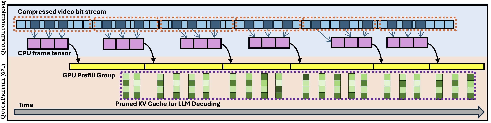
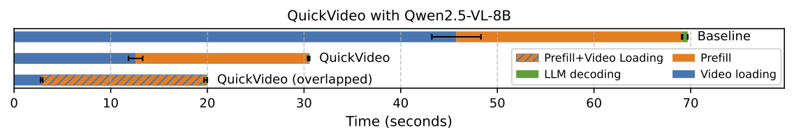
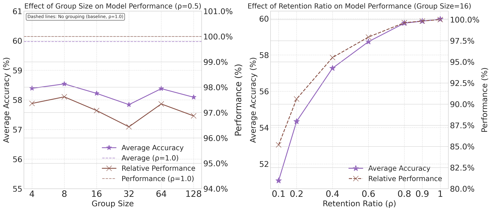

# QuickVideo
<p align="center">
  
</p>

<h3 align="center">
Efficient video loading and context prefill for hour-long video understanding
</h3>

<p align="center">
<em><strong>Benjamin Schneider*</strong> • <strong>Dongfu Jiang*</strong> • <strong>Chao Du</strong> • <strong>Tianyu Pang</strong> • <strong>Wenhu Chen</strong></em>
</p>

<p align="center">
<sub>University of Waterloo • SeaAI Lab</sub>
</p>

<p align="center">
| 
<a href="https://github.com/TIGER-AI-Lab/QuickVideo?tab=readme-ov-file#installation"><b>Documentation</b></a> | 
<a href="https://arxiv.org/abs/2505.16175"><b>Paper</b></a> | 
<a href="https://github.com/TIGER-AI-Lab/QuickCodec"><b>QuickCodec</b></a> |
<a href="https://github.com/TIGER-AI-Lab/QuickVideo?tab=readme-ov-file#usage"><b>QuickPrefill</b></a> 
|
</p>

## Introduction
Long video understanding has emerged as a crucial capability in real-world applications such as meeting summarization, video surveillance, educational lecture analysis, and content moderation. However, it remains computationally prohibitive for VideoLLMs, primarily due to two bottlenecks:
1. **sequential video decoding**, the process of converting the raw bit stream to RGB frames can take up to a minute for hour-long video inputs
2. **costly prefilling of up to several million tokens for LLM inference**, resulting in high latency and memory use. 



To address these challenges, we propose **QuickVideo**, a system-algorithm co-design that substantially accelerates long video understanding to support real-time downstream applications. It comprises three key innovations: 

- **QuickDecoder**, a parallelized CPU-based video decoder that achieves 2–3 times speedup by splitting videos into keyframe-aligned intervals processed concurrently. 
- **QuickPrefill**, a memory-efficient prefilling method by group-based prefilling (save activation memory) and KV-cache pruning (saving KV memory) to support more frames with less GPU memory. We found that the simply always keeping KV tokens with smallest **key norms (L2)** can achieve 97% of the original performance while reducing the KV-cache size by 50%.
- **Overlapping scheme that overlaps CPU video decoding with GPU inference**. This brings the end-to-end latency down from 70 seconds to 20 seconds for a 1-hour video, achieving a 3.5x speedup (see following figure).

$\downarrow$


We evaluate both QuickCodec on video decoding efficiency (left figure) and QuickPrefill with 50% of the KV-cache tokens pruned (right figure and hidden table). Results show significant speedup and memory saving while preserving 97% of the original performance on 4 long video understanding benchmarks: VideoMME, LongVideoBench, LVBench, and MLVU.

<table>
  <tr>
    <td width="34%">
      
    </td>
    <td width="66%">
      
    </td>
  </tr>
</table>

<details>
<summary>Click to see the performance of different pruning methods</summary>

<table style="width: 100%; border-collapse: collapse; font-family: Arial, sans-serif;">
  <colgroup>
    <col style="width: 10%;">
    <col style="width: 20%;">
    <col style="width: 8%;">
    <col style="width: 10%;">
    <col style="width: 15%;">
    <col style="width: 10%;">
    <col style="width: 10%;">
    <col style="width: 7%;">
    <col style="width: 10%;">
  </colgroup>
  <thead>
    <tr style="background-color: #f2f2f2;">
      <th style="border: 1px solid #ddd; padding: 8px; text-align: center;">Group Size</th>
      <th style="border: 1px solid #ddd; padding: 8px; text-align: center;">KV Pruning method</th>
      <th style="border: 1px solid #ddd; padding: 8px; text-align: center;">ρ</th>
      <th style="border: 1px solid #ddd; padding: 8px; text-align: center;">VideoMME</th>
      <th style="border: 1px solid #ddd; padding: 8px; text-align: center;">LongVideoBench (val)</th>
      <th style="border: 1px solid #ddd; padding: 8px; text-align: center;">LVBench</th>
      <th style="border: 1px solid #ddd; padding: 8px; text-align: center;">MLVU (dev)</th>
      <th style="border: 1px solid #ddd; padding: 8px; text-align: center;">Avg</th>
      <th style="border: 1px solid #ddd; padding: 8px; text-align: center;">Performance</th>
    </tr>
  </thead>
  <tbody>
    <tr style="background-color: #e8f4f8;">
      <td colspan="9" style="border: 1px solid #ddd; padding: 8px; font-weight: bold; text-align: center;">64 Frames</td>
    </tr>
    <tr>
      <td style="border: 1px solid #ddd; padding: 8px; text-align: center;">-</td>
      <td style="border: 1px solid #ddd; padding: 8px; text-align: center;">-</td>
      <td style="border: 1px solid #ddd; padding: 8px; text-align: center;">1</td>
      <td style="border: 1px solid #ddd; padding: 8px; text-align: center;">62.41</td>
      <td style="border: 1px solid #ddd; padding: 8px; text-align: center;">59.69</td>
      <td style="border: 1px solid #ddd; padding: 8px; text-align: center;">40.09</td>
      <td style="border: 1px solid #ddd; padding: 8px; text-align: center;">63.86</td>
      <td style="border: 1px solid #ddd; padding: 8px; text-align: center;">56.51</td>
      <td style="border: 1px solid #ddd; padding: 8px; text-align: center;">100.00%</td>
    </tr>
    <tr>
      <td style="border: 1px solid #ddd; padding: 8px; text-align: center;">16</td>
      <td style="border: 1px solid #ddd; padding: 8px; text-align: center;">Value Norms</td>
      <td style="border: 1px solid #ddd; padding: 8px; text-align: center;">0.5</td>
      <td style="border: 1px solid #ddd; padding: 8px; text-align: center;">47.63</td>
      <td style="border: 1px solid #ddd; padding: 8px; text-align: center;">35.98</td>
      <td style="border: 1px solid #ddd; padding: 8px; text-align: center;">30.92</td>
      <td style="border: 1px solid #ddd; padding: 8px; text-align: center;">31.38</td>
      <td style="border: 1px solid #ddd; padding: 8px; text-align: center;">36.48</td>
      <td style="border: 1px solid #ddd; padding: 8px; text-align: center;">64.55%</td>
    </tr>
    <tr>
      <td style="border: 1px solid #ddd; padding: 8px; text-align: center;">16</td>
      <td style="border: 1px solid #ddd; padding: 8px; text-align: center;">Attention Scores</td>
      <td style="border: 1px solid #ddd; padding: 8px; text-align: center;">0.5</td>
      <td style="border: 1px solid #ddd; padding: 8px; text-align: center;">58.63</td>
      <td style="border: 1px solid #ddd; padding: 8px; text-align: center;">52.95</td>
      <td style="border: 1px solid #ddd; padding: 8px; text-align: center;">37.83</td>
      <td style="border: 1px solid #ddd; padding: 8px; text-align: center;">59.87</td>
      <td style="border: 1px solid #ddd; padding: 8px; text-align: center;">52.32</td>
      <td style="border: 1px solid #ddd; padding: 8px; text-align: center;">92.58%</td>
    </tr>
    <tr>
      <td style="border: 1px solid #ddd; padding: 8px; text-align: center;">16</td>
      <td style="border: 1px solid #ddd; padding: 8px; text-align: center;">Key Norms (↓)</td>
      <td style="border: 1px solid #ddd; padding: 8px; text-align: center;">0.5</td>
      <td style="border: 1px solid #ddd; padding: 8px; text-align: center;">60.56</td>
      <td style="border: 1px solid #ddd; padding: 8px; text-align: center;">56.17</td>
      <td style="border: 1px solid #ddd; padding: 8px; text-align: center;">37.70</td>
      <td style="border: 1px solid #ddd; padding: 8px; text-align: center;">62.34</td>
      <td style="border: 1px solid #ddd; padding: 8px; text-align: center;">54.19</td>
      <td style="border: 1px solid #ddd; padding: 8px; text-align: center;">95.90%</td>
    </tr>
    <tr style="background-color: #e8f4f8;">
      <td colspan="9" style="border: 1px solid #ddd; padding: 8px; font-weight: bold; text-align: center;">128 Frames</td>
    </tr>
    <tr>
      <td style="border: 1px solid #ddd; padding: 8px; text-align: center;">-</td>
      <td style="border: 1px solid #ddd; padding: 8px; text-align: center;">-</td>
      <td style="border: 1px solid #ddd; padding: 8px; text-align: center;">1</td>
      <td style="border: 1px solid #ddd; padding: 8px; text-align: center;">66.41</td>
      <td style="border: 1px solid #ddd; padding: 8px; text-align: center;">60.96</td>
      <td style="border: 1px solid #ddd; padding: 8px; text-align: center;">42.87</td>
      <td style="border: 1px solid #ddd; padding: 8px; text-align: center;">66.86</td>
      <td style="border: 1px solid #ddd; padding: 8px; text-align: center;">59.27</td>
      <td style="border: 1px solid #ddd; padding: 8px; text-align: center;">100.00%</td>
    </tr>
    <tr>
      <td style="border: 1px solid #ddd; padding: 8px; text-align: center;">16</td>
      <td style="border: 1px solid #ddd; padding: 8px; text-align: center;">Value Norms</td>
      <td style="border: 1px solid #ddd; padding: 8px; text-align: center;">0.5</td>
      <td style="border: 1px solid #ddd; padding: 8px; text-align: center;">48.56</td>
      <td style="border: 1px solid #ddd; padding: 8px; text-align: center;">37.32</td>
      <td style="border: 1px solid #ddd; padding: 8px; text-align: center;">30.73</td>
      <td style="border: 1px solid #ddd; padding: 8px; text-align: center;">38.51</td>
      <td style="border: 1px solid #ddd; padding: 8px; text-align: center;">38.78</td>
      <td style="border: 1px solid #ddd; padding: 8px; text-align: center;">65.42%</td>
    </tr>
    <tr>
      <td style="border: 1px solid #ddd; padding: 8px; text-align: center;">16</td>
      <td style="border: 1px solid #ddd; padding: 8px; text-align: center;">Attention Scores</td>
      <td style="border: 1px solid #ddd; padding: 8px; text-align: center;">0.5</td>
      <td style="border: 1px solid #ddd; padding: 8px; text-align: center;">60.96</td>
      <td style="border: 1px solid #ddd; padding: 8px; text-align: center;">55.20</td>
      <td style="border: 1px solid #ddd; padding: 8px; text-align: center;">39.70</td>
      <td style="border: 1px solid #ddd; padding: 8px; text-align: center;">64.36</td>
      <td style="border: 1px solid #ddd; padding: 8px; text-align: center;">55.06</td>
      <td style="border: 1px solid #ddd; padding: 8px; text-align: center;">92.89%</td>
    </tr>
    <tr>
      <td style="border: 1px solid #ddd; padding: 8px; text-align: center;">16</td>
      <td style="border: 1px solid #ddd; padding: 8px; text-align: center;">Key Norms (↓)</td>
      <td style="border: 1px solid #ddd; padding: 8px; text-align: center;">0.5</td>
      <td style="border: 1px solid #ddd; padding: 8px; text-align: center;">63.41</td>
      <td style="border: 1px solid #ddd; padding: 8px; text-align: center;">58.19</td>
      <td style="border: 1px solid #ddd; padding: 8px; text-align: center;">39.57</td>
      <td style="border: 1px solid #ddd; padding: 8px; text-align: center;">64.99</td>
      <td style="border: 1px solid #ddd; padding: 8px; text-align: center;">56.54</td>
      <td style="border: 1px solid #ddd; padding: 8px; text-align: center;">95.39%</td>
    </tr>
    <tr style="background-color: #e8f4f8;">
      <td colspan="9" style="border: 1px solid #ddd; padding: 8px; font-weight: bold; text-align: center;">256 Frames</td>
    </tr>
    <tr>
      <td style="border: 1px solid #ddd; padding: 8px; text-align: center;">-</td>
      <td style="border: 1px solid #ddd; padding: 8px; text-align: center;">-</td>
      <td style="border: 1px solid #ddd; padding: 8px; text-align: center;">1</td>
      <td style="border: 1px solid #ddd; padding: 8px; text-align: center;">65.78</td>
      <td style="border: 1px solid #ddd; padding: 8px; text-align: center;">61.56</td>
      <td style="border: 1px solid #ddd; padding: 8px; text-align: center;">43.90</td>
      <td style="border: 1px solid #ddd; padding: 8px; text-align: center;">68.65</td>
      <td style="border: 1px solid #ddd; padding: 8px; text-align: center;">59.97</td>
      <td style="border: 1px solid #ddd; padding: 8px; text-align: center;">100.00%</td>
    </tr>
    <tr>
      <td style="border: 1px solid #ddd; padding: 8px; text-align: center;">16</td>
      <td style="border: 1px solid #ddd; padding: 8px; text-align: center;">Value Norms</td>
      <td style="border: 1px solid #ddd; padding: 8px; text-align: center;">0.5</td>
      <td style="border: 1px solid #ddd; padding: 8px; text-align: center;">48.33</td>
      <td style="border: 1px solid #ddd; padding: 8px; text-align: center;">38.89</td>
      <td style="border: 1px solid #ddd; padding: 8px; text-align: center;">31.38</td>
      <td style="border: 1px solid #ddd; padding: 8px; text-align: center;">37.74</td>
      <td style="border: 1px solid #ddd; padding: 8px; text-align: center;">39.08</td>
      <td style="border: 1px solid #ddd; padding: 8px; text-align: center;">65.17%</td>
    </tr>
    <tr>
      <td style="border: 1px solid #ddd; padding: 8px; text-align: center;">16</td>
      <td style="border: 1px solid #ddd; padding: 8px; text-align: center;">Attention Scores</td>
      <td style="border: 1px solid #ddd; padding: 8px; text-align: center;">0.5</td>
      <td style="border: 1px solid #ddd; padding: 8px; text-align: center;">62.52</td>
      <td style="border: 1px solid #ddd; padding: 8px; text-align: center;">57.22</td>
      <td style="border: 1px solid #ddd; padding: 8px; text-align: center;">41.96</td>
      <td style="border: 1px solid #ddd; padding: 8px; text-align: center;">67.27</td>
      <td style="border: 1px solid #ddd; padding: 8px; text-align: center;">57.24</td>
      <td style="border: 1px solid #ddd; padding: 8px; text-align: center;">95.45%</td>
    </tr>
    <tr>
      <td style="border: 1px solid #ddd; padding: 8px; text-align: center;">16</td>
      <td style="border: 1px solid #ddd; padding: 8px; text-align: center;">Key Norms (↓)</td>
      <td style="border: 1px solid #ddd; padding: 8px; text-align: center;">0.5</td>
      <td style="border: 1px solid #ddd; padding: 8px; text-align: center;">64.04</td>
      <td style="border: 1px solid #ddd; padding: 8px; text-align: center;">60.21</td>
      <td style="border: 1px solid #ddd; padding: 8px; text-align: center;">41.90</td>
      <td style="border: 1px solid #ddd; padding: 8px; text-align: center;">66.73</td>
      <td style="border: 1px solid #ddd; padding: 8px; text-align: center;">58.22</td>
      <td style="border: 1px solid #ddd; padding: 8px; text-align: center;">97.08%</td>
    </tr>
    <tr style="background-color: #e8f4f8;">
      <td colspan="9" style="border: 1px solid #ddd; padding: 8px; font-weight: bold; text-align: center;">1024 Frames</td>
    </tr>
    <tr>
      <td style="border: 1px solid #ddd; padding: 8px; text-align: center;">-</td>
      <td style="border: 1px solid #ddd; padding: 8px; text-align: center;">-</td>
      <td style="border: 1px solid #ddd; padding: 8px; text-align: center;">1</td>
      <td style="border: 1px solid #ddd; padding: 8px; text-align: center;">62.00</td>
      <td style="border: 1px solid #ddd; padding: 8px; text-align: center;">60.43</td>
      <td style="border: 1px solid #ddd; padding: 8px; text-align: center;">42.29</td>
      <td style="border: 1px solid #ddd; padding: 8px; text-align: center;">63.48</td>
      <td style="border: 1px solid #ddd; padding: 8px; text-align: center;">57.05</td>
      <td style="border: 1px solid #ddd; padding: 8px; text-align: center;">100.00%</td>
    </tr>
    <tr>
      <td style="border: 1px solid #ddd; padding: 8px; text-align: center;">16</td>
      <td style="border: 1px solid #ddd; padding: 8px; text-align: center;">Value Norms</td>
      <td style="border: 1px solid #ddd; padding: 8px; text-align: center;">0.5</td>
      <td style="border: 1px solid #ddd; padding: 8px; text-align: center;">47.37</td>
      <td style="border: 1px solid #ddd; padding: 8px; text-align: center;">33.66</td>
      <td style="border: 1px solid #ddd; padding: 8px; text-align: center;">29.18</td>
      <td style="border: 1px solid #ddd; padding: 8px; text-align: center;">32.65</td>
      <td style="border: 1px solid #ddd; padding: 8px; text-align: center;">35.71</td>
      <td style="border: 1px solid #ddd; padding: 8px; text-align: center;">62.60%</td>
    </tr>
    <tr>
      <td style="border: 1px solid #ddd; padding: 8px; text-align: center;">16</td>
      <td style="border: 1px solid #ddd; padding: 8px; text-align: center;">Attention Scores</td>
      <td style="border: 1px solid #ddd; padding: 8px; text-align: center;">0.5</td>
      <td style="border: 1px solid #ddd; padding: 8px; text-align: center;">62.22</td>
      <td style="border: 1px solid #ddd; padding: 8px; text-align: center;">58.49</td>
      <td style="border: 1px solid #ddd; padding: 8px; text-align: center;">42.03</td>
      <td style="border: 1px solid #ddd; padding: 8px; text-align: center;">64.45</td>
      <td style="border: 1px solid #ddd; padding: 8px; text-align: center;">56.80</td>
      <td style="border: 1px solid #ddd; padding: 8px; text-align: center;">99.56%</td>
    </tr>
    <tr>
      <td style="border: 1px solid #ddd; padding: 8px; text-align: center;">16</td>
      <td style="border: 1px solid #ddd; padding: 8px; text-align: center;">Key Norms</td>
      <td style="border: 1px solid #ddd; padding: 8px; text-align: center;">0.5</td>
      <td style="border: 1px solid #ddd; padding: 8px; text-align: center;">59.99</td>
      <td style="border: 1px solid #ddd; padding: 8px; text-align: center;">61.59</td>
      <td style="border: 1px solid #ddd; padding: 8px; text-align: center;">40.80</td>
      <td style="border: 1px solid #ddd; padding: 8px; text-align: center;">64.76</td>
      <td style="border: 1px solid #ddd; padding: 8px; text-align: center;">56.78</td>
      <td style="border: 1px solid #ddd; padding: 8px; text-align: center;">99.53%</td>
    </tr>
  </tbody>
</table>

</details>

## Installation
```bash
uv sync
source .venv/bin/activate
uv pip install -e .
uv pip install flash-attn --no-build-isolation
```

## Usage

1. Download the example video path
```bash
wget https://github.com/SCZwangxiao/video-FlexReduc/raw/refs/heads/main/misc/Q8AZ16uBhr8_resized_fps2_mute.mp4
video_path="Q8AZ16uBhr8_resized_fps2_mute.mp4"
#!/bin/bash
```

2. Run the QuickVideo with interleaved video decoding and group-based context prefilling with kv cache pruning.
```python
from lvu import LVU, LVUConfig
model_name_or_path = "Qwen/Qwen2.5-VL-7B-Instruct"
model_type = "qwen25_lvu_interleaved"
config = LVUConfig(
    model_name_or_path=model_name_or_path,
    model_type=model_type,
    top_k_predict_type="key_norms_small",
    video_group_size=16, # 16 frames per group
    top_k=64, # keep 64 tokens for each group
    top_p=None, # None or a float from 0 to 1, means pruning top_p * 100% of the tokens
    prefill_prune_starting_layer=None, # None or 0 means prune all layers
    num_frames=1024, # 1024 frames in total
    fps=None, 
    use_tqdm=True,
)
lvu = LVU(config)

question = "Describe this video."
video_path = "Q8AZ16uBhr8_resized_fps2_mute.mp4"
generation_kwargs = {
    "max_new_tokens": 128,
    "do_sample": False,
    "top_p": 1.0,
}
output = lvu.generate(question, video_path, **generation_kwargs)
print(output)
"""
# Example output
total time spent fetching frames was: 0.32964205741882324
total time spent on processor was: 10.441518306732178
total time spent on prefill was: 22.954123497009277
total time spent on e2e fetching and decoding was: 27.645442724227905
total time spent on decoding was: 4.490285396575928
Time saved by interleaved processing was: 10.5701265335083
['The video is a compilation of classic animated shorts featuring iconic characters from the 1940s and 1950s, showcasing slapstick humor and vibrant animation styles typical of that era. The clips include:\n\n1. **"A Bug\'s Life"**: A rabbit character is seen in a desert setting, engaging in a comedic chase sequence with a carrot. The rabbit exhibits exaggerated expressions and movements, typical of the cartoon\'s slapstick style.\n\n2. **"The Wabbit Who Could"**: Bugs Bunny appears in a whimsical scene where he is performing a magic trick involving a carrot. The animation is colorful and lively']
"""
```

3. Run the QuickVideo with non-interleaved video decoding and group-based context prefilling without kv cache pruning.
```python
from lvu import LVU, LVUConfig
model_name_or_path = "Qwen/Qwen2.5-VL-7B-Instruct"
model_type = "qwen25_lvu"
config = LVUConfig(
    model_name_or_path=model_name_or_path,
    model_type=model_type,
    top_k_predict_type="key_norms_small",
    video_group_size=16, # 16 frames per group
    top_k=64, # keep 64 tokens for each group
    top_p=None, # None or a float from 0 to 1, means pruning top_p * 100% of the tokens
    prefill_prune_starting_layer=None, # None or 0 means prune all layers
    num_frames=1024, # 1024 frames in total
    fps=None, 
    use_tqdm=True,
)
lvu = LVU(config)

question = "Describe this video."
video_path = "Q8AZ16uBhr8_resized_fps2_mute.mp4"
generation_kwargs = {
    "max_new_tokens": 128,
    "do_sample": False,
    "top_p": 1.0,
}
output = lvu.generate(question, video_path, **generation_kwargs)
print(output)
"""
# Example output
total time spent fetching frames was: 16.419464826583862
total time spent on processor was: 15.166603088378906
total time spent on prefill was: 21.452709436416626
total time spent on e2e fetching and decoding was: 57.85865354537964
total time spent on decoding was: 4.586025714874268
Time saved by interleaved processing was: -0.23385047912597656
['The video is a compilation of classic animated shorts featuring iconic characters from the 1940s and 1950s, showcasing slapstick humor and vibrant animation styles typical of that era. The clips include:\n\n1. **"A Bug\'s Life"**: A rabbit character is seen in a desert setting, engaging in a comedic chase sequence with a carrot. The rabbit exhibits exaggerated expressions and movements, typical of the cartoon\'s slapstick style.\n\n2. **"The Wabbit Who Could"**: Bugs Bunny appears in a whimsical scene where he is performing a magic trick involving a carrot. The animation is colorful and lively']
"""
```
**Clearly, the non-interleaved processing takes about 58 seconds, which is 2 times longer than the interleaved processing.**

## Video Understand Benchmark evaluation
We use lmms-eval to evaluate the performance of QuickVideo on the Video Understand Benchmark.
```bash
git submodule update --init --recursive
cd lmms-eval
uv pip install -e .
```

**Evaluation example**
```bash
export DEEPCODEC_CORES=8
export FORCE_QWENVL_VIDEO_READER='deepcodec'
adaptive_local_attention=True
num_processes=8
benchmark_name=lvbench,videomme,lvbench,mlvu_dev
# we recommend to select one combination of the following parameters to run the evaluation instead of all combinations if you are just testing.
for num_frame in 64 128 256 1024; do
    for local_attention_group_size in 16; do
        for top_k in 720 ; do
            for predict_type in key_norms_small vector_norms query_attention_weights; do 
                for top_k_starting_layer in 0; do
                    for prune_during_prefill_layer_idx in -1; do
                        echo "num_frame: $num_frame, local_attention_group_size: $local_attention_group_size, top_k: $top_k, predict_type: $predict_type, top_k_starting_layer: $top_k_starting_layer, prune_during_prefill_layer_idx: $prune_during_prefill_layer_idx"
                        accelerate launch --num_processes ${num_processes} --main_process_port 12351 -m lmms_eval \
                            --model qwen2_5_vl \
                            --model_args "pretrained="Qwen/Qwen2.5-VL-7B-Instruct",max_num_frames=$num_frame,use_flash_attention_2=True,adaptive_local_attention=$adaptive_local_attention,local_attention_group_size=${local_attention_group_size},top_k=$top_k,predict_type=$predict_type,top_k_starting_layer=$top_k_starting_layer,prune_during_prefill_layer_idx=$prune_during_prefill_layer_idx" \
                            --tasks $benchmark_name \
                            --batch_size 1 \
                            --log_samples \
                            --log_samples_suffix "Qwen2.5-VL-7B-Instruct-frames-$num_frame-local_attention_group_size-$local_attention_group_size-top_k-$top_k-predict_type-$predict_type-top_k_starting_layer-$top_k_starting_layer-prune_during_prefill_layer_idx-$prune_during_prefill_layer_idx" \
                            --output_path ./logs/qwen2_5_vl_$benchmark_name_$num_frame
                    done
                done
            done
        done
    done
done
```

(Note: for LVBench you might need to unzip the videos by your own first after running it for one time.)

## Contribution of new models and new kv pruning methods
To be added.

## Citation
If you find this repository useful, please consider citing our paper:
```bibtex
@inproceedings{Schneider2025QuickVideoRL,
  title={QuickVideo: Real-Time Long Video Understanding with System Algorithm Co-Design},
  author={Benjamin Schneider and Dongfu Jiang and Chao Du and Tianyu Pang and Wenhu Chen},
  year={2025},
  url={https://api.semanticscholar.org/CorpusID:278789043}
}
```